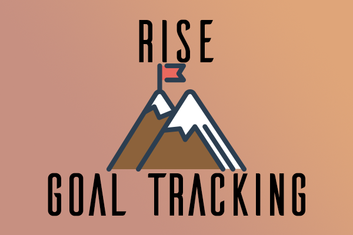

## Rise: Goal Tracking
Rise up and accomplish your dreams. 
HackPrinceton 2017 submission 

## What it does

Allows a user to track one long term goal. They can set a new goal, revise their old goal, add time to their goal, ask for advice on how to accomplish their goal, and view statistics about their goal. 

## How I built it

I built this application using Javascript in conjunction with the Amazon-Alexa-SDK. I used the Alexa Skills Kit that is hosted on AWS Lambda. Furthermore, this skill retrieves product information from Amazon through the Amazon Product Advertising API and stores user information in a DynamoDB.

The next steps include adding a simple user experience, allowing a user to track more than one goal at a time, and lastly, creating a library of resources the user can look back upon when they are pursuing their goal. 
